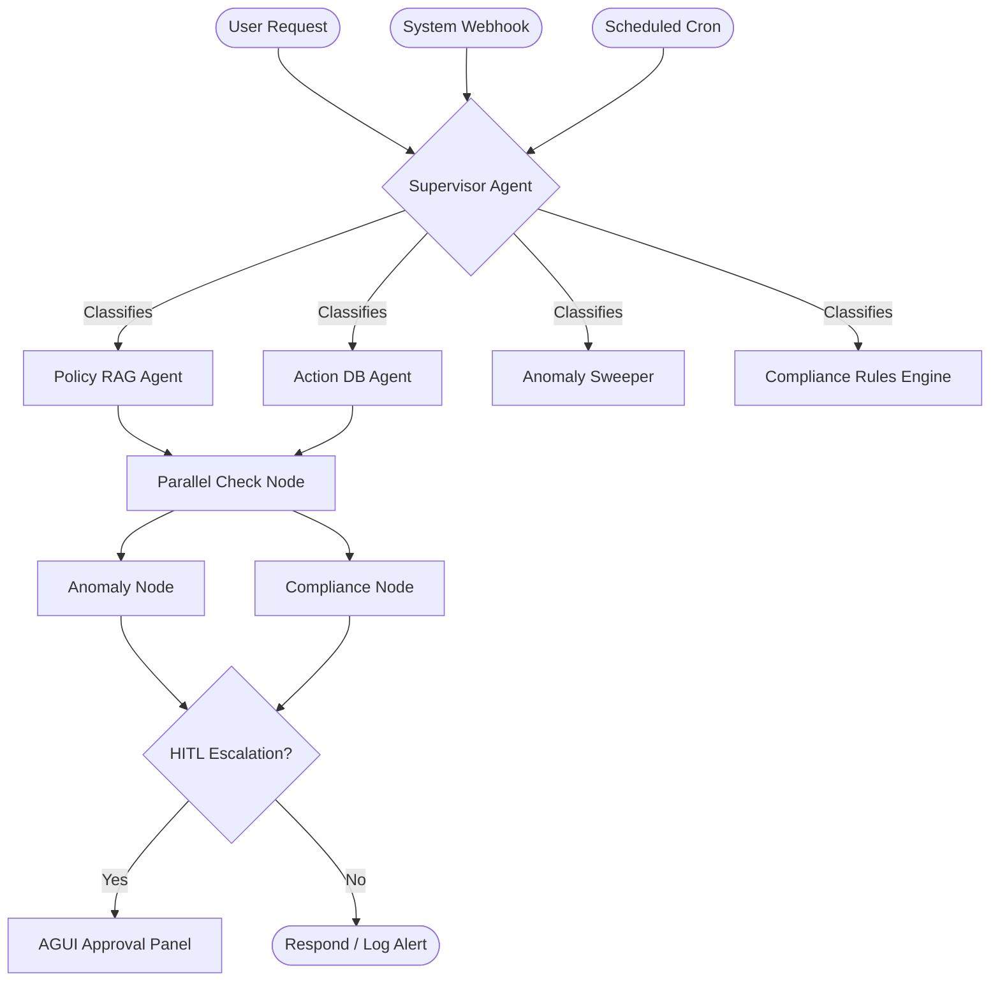

# Knowledge Transfer (KT) Developer Guide: HR Ops Platform

Welcome to the Developer Guide and Knowledge Transfer document for the Self-Healing HR Ops Platform. This guide is designed to help developers quickly understand the system architecture, code layout, agent flows, and development practices.

---

## 1. System Overview

The HR Ops Platform is an agentic, self-healing HR assistant that automates three core operational triggers:
1. **Reactive Requests:** Natural-language queries submitted by employees or HR managers.
2. **Scheduled Scans:** Automated, cron-like anomaly sweeps over the employee dataset.
3. **System-Generated Alerts:** External webhooks from upstream engines (e.g. payroll, attendance) routed for automated investigation.



---

## 2. Backend Architecture

The backend is built with **FastAPI** and uses **LangGraph** for multi-agent state orchestration.

### Directory Structure
```
backend/
├── config/                  # Configuration YAMLs (app, nvidia, compliance rules)
├── data/                    # DB file, logs, and vector store cache
├── src/
│   ├── agents/              # LangGraph definition, nodes, and states
│   ├── api/                 # FastAPI routes (chat, alerts, auth, debug, webhooks)
│   ├── core/                # Settings, logger, custom exceptions, responses
│   ├── domain/              # Pydantic schemas and domain models
│   ├── guardrails/          # Input, output, tool, and cost guardrails
│   ├── infrastructure/      # LLM clients, NVIDIA Embeddings, Langfuse tracing
│   ├── intelligence/        # Anomaly detectors, compliance evaluator, RL LinUCB
│   ├── memory/              # Vector store client, episodic memory, chunking
│   ├── repositories/        # SQLAlchemy connection, ORM models, SQL helpers
│   ├── services/            # Conversation sessions, scheduler, DB schema warmups
│   └── utils/               # Semantic cache, alert store, PII redactor
└── tests/                   # Pytest test suite
```

### Core Technologies
*   **FastAPI & Uvicorn:** Exposes REST APIs, webhooks, and Server-Sent Events (SSE) streaming.
*   **SQLAlchemy & SQLite:** Database storing `employees`, `attendance`, `payroll`, `leaves`, and `performance` records.
*   **LangGraph:** Orchestrates the multi-agent execution pipeline using `SharedState`.
*   **NVIDIA Embeddings:** Powers the semantic cache and RAG vector store.
*   **Langfuse:** Provides complete tracing and observability for agent runs.

---

## 3. Agentic & Intelligence Layer

### A. The Supervisor Agent
*   **Location:** `backend/src/agents/advanced/supervisor.py`
*   **Role:** Analyzes the incoming query, checks the semantic cache to skip redundant LLM calls, classifies the task into a target agent node, and uses a **LinUCB Bandit** reinforcement learning model to select/refine routing based on context features (complexity, urgency).
*   **Override:** Force-routes specialized tasks (like scheduled scans) directly to target nodes (like the anomaly node).

### B. The Action Agent (Text-to-SQL)
*   **Location:** `backend/src/agents/nodes/action_node.py`
*   **Role:** Translates natural language requests into tool invocations. It supports:
    *   `search_employee_by_name(name)`
    *   `lookup_employee(employee_id)`
    *   `execute_db_query(sql_query)` (Uses a schema-understanding prompt to query SQLite dynamically)
    *   `modify_record(employee_id, field, value)`
*   **Write Interception:** Any SQL write queries (`INSERT`, `UPDATE`, `DELETE`) or `modify_record` calls are intercepted for human approval via HITL.

### C. The Policy Agent (RAG)
*   **Location:** `backend/src/agents/nodes/policy_node.py`
*   **Role:** Resolves questions about company policies (leave policy, travel regulations) by searching a vector database containing chunked policy documents.

### D. Parallel Checks Node
*   **Location:** `backend/src/agents/nodes/parallel_check_node.py`
*   **Role:** Concurrently runs the **Anomaly Node** and the **Compliance Node** as background verifiers after the primary agent completes its task. Merges results back into the state.

### E. Anomaly Node (23 Rules)
*   **Location:** `backend/src/agents/nodes/anomaly_node.py` and `backend/src/intelligence/anomaly.py`
*   **Role:** Evaluates employee records across four domains using statistical detectors (e.g. Z-scores, IQR bounds):
    *   **Payroll Outliers (R1-R6):** Salary spikes, salary/position mismatches, backdated pay.
    *   **Leave Abuse (R7-R12):** Exceeding accrued leave, leave ratio anomalies, leave hoarding.
    *   **Compliance Violations (R13-R18):** Missing reviews, probation breaches, remote executives.
    *   **Inactivity Scans (R19-R23):** Ghost employees, high absenteeism, chronic lateness, payroll drains.
*   **Bandit Action:** Uses an anomaly bandit to assign confidence-based actions (auto-escalate, HITL queue, or log informational).

### F. Compliance Node & Rules Engine
*   **Location:** `backend/src/agents/nodes/compliance_node.py` and `backend/src/intelligence/compliance.py`
*   **Role:** Deterministically checks actions/queries against `compliance_rules.yaml`. If matched, triggers a **veto** (hard block), **flag** (HITL review), **warn** (log warning), or **notify**.
*   **Rich Response Synthesis:** Uses `llm_call` to synthesize a friendly explanation of the compliance evaluation.

---

## 4. Frontend Architecture

The frontend is built with **React (TypeScript)**, **Vite**, and styled with custom premium CSS tokens.

### Key Pages (`frontend/src/pages/`)
1.  **ChatInterface.tsx:** Conversational chat interface for reactive triggers supporting real-time node-by-node SSE streaming.
2.  **ScanOutcomes.tsx:** Visual logs of scheduled anomaly sweeps, system webhook alerts, and manual scans. Includes status cards and detailed trace reports.
3.  **HITLPanel.tsx:** Admin control board where HR managers approve/deny pending database modifications or high-severity alerts.
4.  **PolicyManager.tsx:** Upload, delete, and download markdown files, and trigger vector store re-indexing.
5.  **RLDashboard.tsx:** Dynamic line charts and bar charts displaying LinUCB Bandit metrics, feedback rewards, and arm selection probabilities.
6.  **TraceList.tsx:** Visualization of LangGraph traces, displaying execution times, prompt tokens, costs, and sub-activities (e.g. vector DB searches, LLM calls).

---

## 5. Developer Knowledge Transfer (KT)

### Development Setup

1.  **Backend Setup:**
    ```powershell
    cd backend
    python -m venv .venv
    .venv\Scripts\activate
    pip install -r requirements.txt
    ```
2.  **Seed Database:**
    ```powershell
    python backend/scripts/load_db.py backend/data/sample_employees.csv
    ```
3.  **Frontend Setup:**
    ```powershell
    cd frontend
    npm install
    ```
4.  **Running Locally:**
    Execute `run.ps1` or `run.bat` from the root workspace directory to start both servers concurrently.
    *   **Backend URL:** http://localhost:8000
    *   **Frontend URL:** http://localhost:5173

### Testing
We use `pytest` for backend unit and integration testing. Set your Python path to the workspace root:
```powershell
$env:PYTHONPATH="."
python -m pytest backend/tests/ -v --tb=short
```

---

## 6. How-To Guides for Developers

### How to Add a New Compliance Rule
1.  Open `backend/config/compliance_rules.yaml`.
2.  Append your rule under the appropriate category:
    ```yaml
      - id: PRIVACY_004
        category: data_privacy
        severity: critical
        action: veto
        description: "Accessing sensitive employee records requires DPO review."
        keywords: ["DPO review", "sensitive logs"]
    ```
3.  Restart the backend server. The rule will automatically load.

### How to Add a New Statistical Anomaly Rule
1.  Open `backend/src/intelligence/anomaly.py`.
2.  Define a new detector function or append your check inside the existing domain helpers (e.g. `detect_payroll_anomalies`).
3.  Construct an `AnomalyResult` object and append it to the outcomes list:
    ```python
    results.append(AnomalyResult(
        detected=True,
        severity=0.85,
        confidence_score=0.90,
        description="[PAYROLL-R24] Custom anomaly description",
        anomaly_field="salary",
        anomaly_type="payroll_custom_rule",
        recommended_action="escalate_hr_review",
        supporting_data={"employee_id": eid}
    ))
    ```
4.  Verify by adding a test case to `backend/tests/test_advanced.py`.
