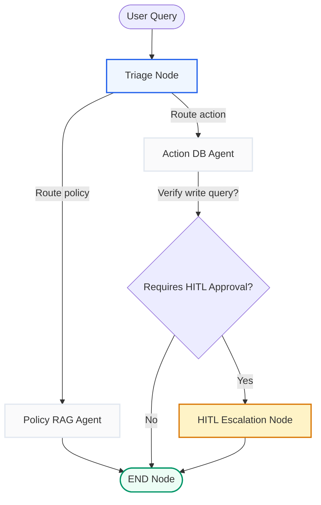
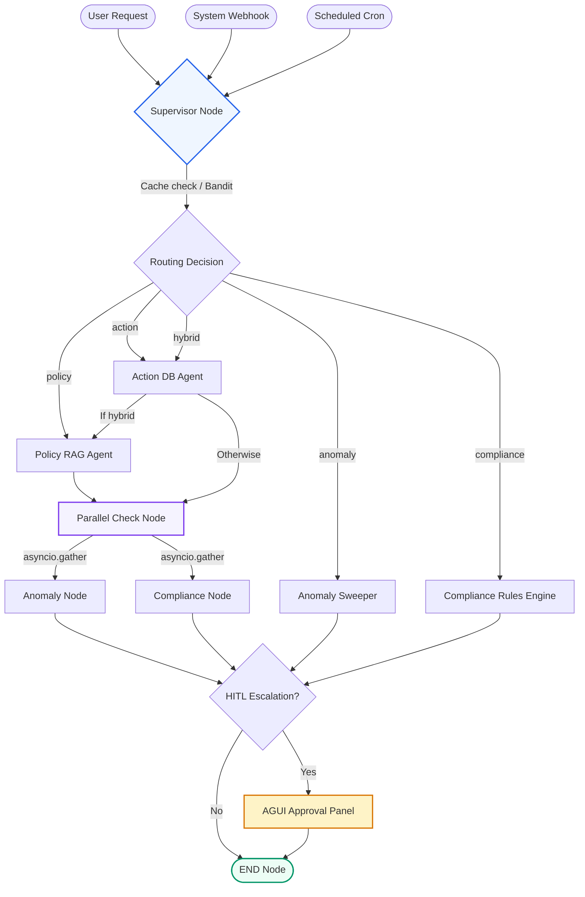
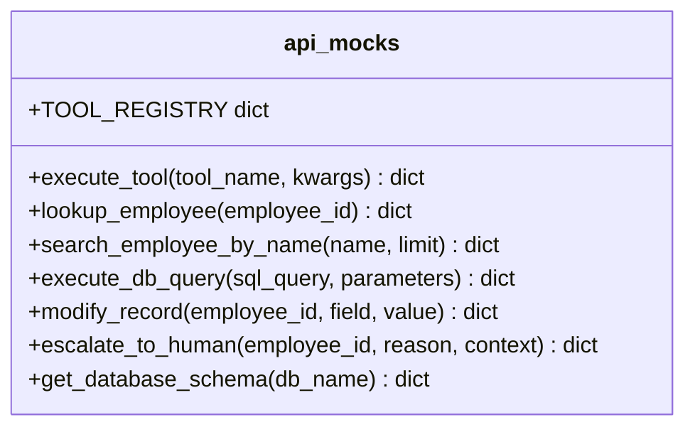

# Knowledge Transfer (KT) Developer Guide: Self-Healing HR Ops Platform

Welcome to the Developer Guide and Knowledge Transfer document for the Self-Healing HR Ops Platform. This guide is designed to help developers quickly understand the system architecture, code layout, agent flows, key architectural decisions, tools design, core algorithms, and development practices.

---

## 1. System Overview

The HR Ops Platform is designed to support two modes of operation:
*   **Standard Mode:** A single-pass linear flow designed for reactive user requests, using direct classification, RAG retrieval, or tool execution.
*   **Advanced Mode:** A self-healing multi-agent orchestration graph driven by a contextual bandit supervisor, parallel background sweeps, and reactive webhook inputs.

### A. Standard Mode Architecture
Designed for low-latency standard QA and lookup tasks. Triage routing is single-pass and handles routing queries directly into policy RAG or database tools.



### B. Advanced Mode Architecture
Features full multi-agent orchestration with reinforcement learning supervisor routing, parallel anomaly/compliance sweeps, and webhook/scheduled trigger ingestion.



---

## 2. Key Architectural Decisions & Approach Choices

To make this product highly responsive, robust, and cost-efficient, several critical architectural decisions and optimization strategies were implemented:

### A. Cooperative Yielding for CPU/DB/API Prioritization
* **Files:** [graph_service.py](file:///c:/Users/purus/learn/HR_Ops/backend/src/services/graph_service.py), [graph.py](file:///c:/Users/purus/learn/HR_Ops/backend/src/graph.py), [scheduler.py](file:///c:/Users/purus/learn/HR_Ops/backend/src/services/scheduler.py)
* **Approach:** Background scheduled scans can be resource-intensive, querying large datasets and executing multiple LLM calls. To prevent database locking, high CPU usage, and API rate-limiting from impacting real-time user experiences, we built a **priority-based cooperative yielding** mechanism.
* **Mechanism:** An async context manager ([UserQueryTracker](file:///c:/Users/purus/learn/HR_Ops/backend/src/services/graph_service.py)) tracks active user-initiated (reactive or system) queries using a counter and an `asyncio.Event`. Every node function in the state graph is wrapped with a check ([cooperative_yield](file:///c:/Users/purus/learn/HR_Ops/backend/src/services/graph_service.py)). If a scheduled scan reaches any node while the active user query count is greater than zero, it automatically pauses, yields the event loop, and waits until all active user queries finish before resuming.

### B. Deterministic Query Pre-Screening (0-Latency / 0-Cost)
* **File:** [action_node.py](file:///c:/Users/purus/learn/HR_Ops/backend/src/agents/nodes/action_node.py)
* **Approach:** The most common database operations in HR are simple employee profile lookups by ID or name (e.g., *"who is John Doe"* or *"get details of EMP0001"*). Calling an LLM to parse these queries is slow, expensive, and subject to parsing errors.
* **Mechanism:** The action node implements a regex-based pre-screening step ([_prescreen_query](file:///c:/Users/purus/learn/HR_Ops/backend/src/agents/nodes/action_node.py)) matching standard ID regexes (`EMP\d{4,}`) and name-lookup patterns. If a pattern matches, it immediately generates a structured tool call (`lookup_employee` or `search_employee_by_name`) without invoking the LLM, reducing latency to **< 5ms** and saving 100% of LLM costs for standard lookups.

### C. Live Database Schema Explanation & Warmup Cache
* **File:** [db_schema_store.py](file:///c:/Users/purus/learn/HR_Ops/backend/src/services/db_schema_store.py)
* **Approach:** A common point of failure for Text-to-SQL agents is translating queries into wrong table joins or filter clauses because they lack semantic context about database relationships.
* **Mechanism:** Instead of hardcoding DDL statements in prompts, we implement a dynamic database schema store. At startup, the backend connects to SQLite, retrieves tables, counts, sample values for text columns, and executes an LLM explanation call ([generate_schema_understanding](file:///c:/Users/purus/learn/HR_Ops/backend/src/services/db_schema_store.py)) to create a natural-language guide on how to join tables and query the data. This schema understanding is cached in memory and injected into the action node prompt, ensuring that dynamic SQL queries remain accurate even if schemas shift.

### D. Semantic Cache for Supervisor Triaging
* **File:** [supervisor.py](file:///c:/Users/purus/learn/HR_Ops/backend/src/agents/advanced/supervisor.py)
* **Approach:** Classification of incoming requests to the supervisor can become a bottleneck and introduce redundant costs for repeated or semantically equivalent questions.
* **Mechanism:** We built a custom supervisor semantic cache ([SupervisorCache](file:///c:/Users/purus/learn/HR_Ops/backend/src/agents/advanced/supervisor.py)). It embeds incoming queries using NVIDIA nv-embed-v1 embeddings and evaluates cosine similarity against cached queries. If a matching classification is found with similarity $\ge 0.95$ within a 1-hour TTL, the system skips the LLM classification step and routes the query instantly.

### E. RL Bandit Routing with Safe Override Gating
* **Files:** [supervisor.py](file:///c:/Users/purus/learn/HR_Ops/backend/src/agents/advanced/supervisor.py), [rl_layer.py](file:///c:/Users/purus/learn/HR_Ops/backend/src/intelligence/rl_layer.py)
* **Approach:** Routing queries solely via static rules or zero-temperature LLMs lacks adaptability, while pure Reinforcement Learning (RL) might make unsafe exploration errors (e.g., routing a compliance query to policy RAG).
* **Mechanism:** We combined LLM classification with a LinUCB contextual bandit. The LLM first classifies the query, and the bandit re-ranks the decision based on complexity and urgency context. Crucially, we enforce a **safety override**: if the LLM detects specialized compliance check, hybrid, or anomaly requests, the supervisor overrides the bandit's explore action and routes directly to the specialized node to ensure policy compliance and data security.

### F. Deterministic Rules Engine + LLM Narrative Synthesis
* **File:** [compliance_node.py](file:///c:/Users/purus/learn/HR_Ops/backend/src/agents/nodes/compliance_node.py)
* **Approach:** Pure LLMs are prone to hallucinating safety violations or missing edge-case policy limits.
* **Mechanism:** The compliance verification runs against a strictly deterministic, YAML-defined rules engine ([evaluate_action](file:///c:/Users/purus/learn/HR_Ops/backend/src/intelligence/compliance.py)) loaded from [compliance_rules.yaml](file:///c:/Users/purus/learn/HR_Ops/backend/config/compliance_rules.yaml). The deterministic outcome (veto, flag, or warn) is guaranteed. We then feed this deterministic outcome into a secondary LLM synthesis step to generate a friendly, natural-language narrative explanation for the user, combining hard security constraints with premium conversational UX.

### G. Confidence-Bucketed Anomaly Routing & Episodic Memory
* **Files:** [anomaly_node.py](file:///c:/Users/purus/learn/HR_Ops/backend/src/agents/nodes/anomaly_node.py), [anomaly.py](file:///c:/Users/purus/learn/HR_Ops/backend/src/intelligence/anomaly.py), [episodic_memory.py](file:///c:/Users/purus/learn/HR_Ops/backend/src/memory/episodic_memory.py)
* **Approach:** Background scans should not overwhelm humans with low-severity alerts, nor should they auto-execute database changes without safety nets.
* **Mechanism:** Outliers are analyzed across 23 statistical rules and assigned confidence scores via the anomaly bandit:
  * **Confidence $\ge 0.85$:** Auto-escalates for remediation.
  * **$0.65 \le$ Confidence $< 0.85$:** Queues in Human-in-the-loop (HITL) for review.
  * **Confidence $< 0.65$:** Logged as informational only.
  Additionally, the node queries a ChromaDB-backed semantic [EpisodicMemory](file:///c:/Users/purus/learn/HR_Ops/backend/src/memory/episodic_memory.py) to retrieve past similar resolved incidents, supplying context that "warm-starts" the LLM's summary generator and prevents duplicate investigation patterns. High-severity incidents are automatically stored back into the episodic memory.

### H. HITL Write Interception & Auto-Expiry Sweep
* **Files:** [action_node.py](file:///c:/Users/purus/learn/HR_Ops/backend/src/agents/nodes/action_node.py), [scheduler.py](file:///c:/Users/purus/learn/HR_Ops/backend/src/services/scheduler.py), [agui_store.py](file:///c:/Users/purus/learn/HR_Ops/backend/src/utils/agui_store.py)
* **Approach:** Prevent unauthorized or accidental modifications to critical HR databases, while avoiding orphaned workflow states if a manager is unavailable to approve a request.
* **Mechanism:** The action node intercepts any SQL write query (`INSERT`, `UPDATE`, `DELETE`) or `modify_record` call, pauses execution, sets `hitl_needed = True`, and registers the request in the AG-UI store. Concurrently, the [AnomalyScheduler](file:///c:/Users/purus/learn/HR_Ops/backend/src/services/scheduler.py) runs an async background task every 10 seconds checking for expired HITL tickets, automatically resolving/denying them when the timeout threshold is breached.

---

## 3. Core Tools Design & Dispatch Architecture

All database queries and integrations are wrapped inside the toolset defined in [api_mocks.py](file:///c:/Users/purus/learn/HR_Ops/backend/src/tools/api_mocks.py). These tools are registered globally in a centralized registry and routed dynamically.



### A. Centralized Tool Dispatcher
The dispatcher patterns translate LLM JSON intents into Python function execution safely:
* **Registry Mapping:** A global `TOOL_REGISTRY` dict maps tool names directly to their function handlers.
* **Unified Executor (`execute_tool`):** Accepts a `tool_name` string and `**kwargs`, locates the function, executes it, and returns the result encapsulated in a standard envelope: `{"tool": tool_name, "result": result}`.

### B. Database Query Engine (`execute_db_query`)
* **Dynamic Read/Write Bifurcation:** The engine inspects the SQL query string (`sql_query.strip().upper()`). If it matches write keywords (`UPDATE`, `INSERT`, `DELETE`, `CREATE`, `DROP`, `ALTER`, `REPLACE`), it marks the request as `write` and calls `conn.commit()`. Otherwise, it treats it as a `read` query.
* **Prompt Protection & Context Capping:** To prevent very large SQL tables from blowing up LLM context window limits, the query tool hard-caps output lists to a maximum of 100 rows (`results[:100]`).
* **Interception Gating:** In [action_node.py](file:///c:/Users/purus/learn/HR_Ops/backend/src/agents/nodes/action_node.py), if `execute_db_query` is identified as a write operation, the node intercepts execution and escalates to HITL before the database query runs.

### C. Search & Profile Enriched Engine (`search_employee_by_name`)
* **Contextual Joins:** Rather than performing a raw table dump, this tool executes a SQLite case-insensitive `LIKE` query over the `employees` table. It then enriches each matched record by querying corresponding rows in `leaves` (returning `leaves_remaining`) and `performance` (fetching the latest review rating and date), presenting a fully unified profile card to the agent.

### D. System Escalation Tool (`escalate_to_human`)
* **Interaction Request Registration:** Translates high-risk anomalies or complex policy questions into a formal ticket (`TKT-XXXX`). It instantiates an `InteractionRequest` object containing the context payload and registers it directly with [agui_store.py](file:///c:/Users/purus/learn/HR_Ops/backend/src/utils/agui_store.py) to render on the HR manager dashboard.

### E. PRAGMA-Driven Schema Inspecting (`get_database_schema`)
* **Runtime Database Cataloging:** Dynamically connects to SQLite and queries the `sqlite_master` tables list, executing `PRAGMA table_info(table_name)` iteratively to retrieve the current physical table schema structure (columns, types, constraints, primary keys) on demand.

### F. Retry Resilience (Tenacity)
* To guarantee robustness during database locks or database migration tasks, sensitive lookup and database update tools (`lookup_employee`, `modify_record`, `escalate_to_human`) are decorated with a retry policy:
  ```python
  @retry(stop=stop_after_attempt(3), wait=wait_exponential(multiplier=1, min=1, max=10))
  ```

---

## 4. Algorithms & Mathematical Foundations

### A. Contextual Bandit Routing (LinUCB)
The supervisor agent utilizes the **LinUCB (Linear Upper Confidence Bound)** contextual bandit algorithm to determine which sub-agent is best suited to resolve an incoming query. 

#### 1. Mathematical Model
For each arm (agent) $a \in \{0, 1, 2, 3\}$ representing `policy`, `action`, `anomaly`, and `compliance`:
* **Covariance Matrix:** $A_a \in \mathbb{R}^{d \times d}$ (initialized as identity matrix $I_d$).
* **Reward Coefficient vector:** $b_a \in \mathbb{R}^d$ (initialized as zero vector).
* **Linear Parameter Estimate:** $\theta_a = A_a^{-1} b_a \in \mathbb{R}^d$.

For an incoming context vector $x \in \mathbb{R}^d$:
1. Calculate the estimated reward payoff and the standard deviation bound:
   $$p_a = \theta_a^T x + \alpha \sqrt{x^T A_a^{-1} x}$$
   where $\alpha$ is the exploration parameter (default `settings.rl_alpha`).
2. Select the optimal arm:
   $$a^* = \arg\max_a p_a$$

#### 2. Feature Vector Design ($d = 8$)
The context vector $x$ captures both semantic classification and syntactic query characteristics:
* $x[0 \dots 3]$: One-hot encoded classification vector representing the supervisor LLM's classification result (`policy`, `action`, `anomaly`, `compliance`).
* $x[4]$: Normalized character length of the query ($\text{length} / 500$).
* $x[5]$: Query complexity (float representation).
* $x[6]$: Urgency flag ($1.0$ if query contains urgent keywords like *"urgent"*, *"asap"*, or *"immediately"*, otherwise $0.0$).
* $x[7]$: Bias term ($1.0$).

#### 3. Feedback and Reward Buffering
To prevent frequent, locking writes to the model pickle file on every single token interaction, a thread-safe buffering system ([FeedbackStore](file:///c:/Users/purus/learn/HR_Ops/backend/src/services/feedback_service.py)) is implemented:
* Payoffs are calculated and recorded as feedback in a memory queue.
* **Implicit Rewards:** Automatically mapped from runtime execution:
  * Compliance Veto = $-0.5$ (penalizes the selected arm).
  * Action Executed = $+0.3$ (rewards successful tool invocation).
  * HITL Approved = $+0.5$ (rewards correct escalation path).
  * HITL Denied = $-0.3$.
* **Batch Flush:** When the buffer length $\ge \text{rl\_batch\_size}$ (default 10), the system processes the batch, updates the LinUCB matrices:
  $$A_{a^*} \leftarrow A_{a^*} + x x^T$$
  $$b_{a^*} \leftarrow b_{a^*} + r x$$
  and persists the state to [rl_bandit.pkl](file:///c:/Users/purus/learn/HR_Ops/backend/data/rl_bandit.pkl).

---

### B. Anomaly Action Bandit
The anomaly scanner uses a separate contextual bandit ([AnomalyActionBandit](file:///c:/Users/purus/learn/HR_Ops/backend/src/intelligence/rl_layer.py)) to map detected outlier events to remediation actions.

#### 1. Arms (6)
* `escalate_hr_review`, `flag_for_review`, `request_manager_review`, `send_notification`, `initiate_pip`, `ignore`.

#### 2. Feature Vector Design ($d = 10$)
* $x[0 \dots 5]$: One-hot encoded action hint recommended by the statistical rule engine.
* $x[6]$: Statistical confidence score of the anomaly (0.0 to 1.0).
* $x[7]$: Severity rating of the anomaly (0.0 to 1.0).
* $x[8]$: Is Payroll category (1.0 or 0.0).
* $x[9]$: Is Leave category (1.0 or 0.0).

---

### C. Statistical Outlier Detection Algorithms
The system processes employee attendance, performance, and payroll logs against 23 rules across 4 categories in [anomaly.py](file:///c:/Users/purus/learn/HR_Ops/backend/src/intelligence/anomaly.py):

#### 1. Z-Score Outlier Detection
For numerical cohorts (e.g., salaries within a department, org-wide leave usage ratios):
* **Mean:** $\mu = \frac{1}{N}\sum_{i=1}^N v_i$
* **Standard Deviation:** $\sigma = \sqrt{\frac{1}{N-1}\sum_{i=1}^N (v_i - \mu)^2}$
* **Z-Score Calculation:** $z = \frac{|v_i - \mu|}{\sigma}$
* **Outlier Gating:** Triggered when $z > 3.0$ (for payroll) or $z > 2.0$ (for attendance absenteeism).

#### 2. IQR (Interquartile Range) Boundary Check
For robust non-parametric outlier checking (Rule 3):
* Sort cohort values and find the Median of the bottom half ($Q_1$) and top half ($Q_3$).
* **Interquartile Range:** $\text{IQR} = Q_3 - Q_1$
* **Fences:** $[\text{Lower Fence}, \text{Upper Fence}] = [Q_1 - 1.5 \times \text{IQR}, \text{Q}_3 + 1.5 \times \text{IQR}]$
* Values falling outside these bounds are flagged.

#### 3. Confidence Mapping Function
To convert raw Z-scores and metrics into normal confidence bounds in range $[0.5, 1.0]$:
$$\text{Sigmoid}(z) = \frac{1}{1 + e^{-z + 2}}$$
$$\text{Confidence}(z) = \text{base} + \text{Sigmoid}(z) \times (1.0 - \text{base})$$

---

### D. Advanced RAG Chunking Algorithms
The platform provides 6 distinct text-partitioning strategies inside [chunking/](file:///c:/Users/purus/learn/HR_Ops/backend/src/memory/chunking) to prepare documents for indexing:

#### 1. Semantic Chunking
* **Algorithm:** Splits documents into sentences using regex boundary lookbehinds `(?<=[.!?])\s+`. Sentence embeddings are generated sequentially. The algorithm tracks the running average embedding of the current chunk. For each sentence, it computes the cosine similarity against the chunk average:
  $$\text{Cosine Similarity} = \frac{\vec{u} \cdot \vec{v}}{\|\vec{u}\| \|\vec{v}\|}$$
  If the similarity falls below `threshold` (default 0.75) and the current block contains $\ge \text{min\_chunk\_size}$ characters, it creates a new chunk boundary, resetting the running average.

#### 2. Late Chunking
* **Algorithm:** Performs recursive character chunking first. Then, it expands each chunk by appending the last 100 characters of the preceding sibling chunk, and prefixing the first 100 characters of the succeeding sibling chunk. This overlaps structural boundaries, preserving semantic context across partitions.

#### 3. Parent-Document Chunking
* **Algorithm:** Indexes child chunks (200 chars) in the vector store for high-precision retrieval, but links them to parent documents (1000 chars) via metadata index mappings. When a query is matched, the larger parent text is injected into the LLM context, preventing incomplete information retrieval.

#### 4. Agentic Chunking
* **Algorithm:** An LLM-driven parser runs over the raw text and is prompted to output logical, self-contained sections separated by custom delimiter tokens (`---CHUNK---`), dynamically grouping lists and descriptions based on topics.

---

### E. Guardrail Regex & Redaction Algorithms
* **File:** [pii_redaction.py](file:///c:/Users/purus/learn/HR_Ops/backend/src/utils/pii_redaction.py)
* **Algorithm:** Regular expressions scan inputs and outputs for PII data. Matches are automatically replaced with redact tags:
  * **Social Security Numbers (SSN):** `\b\d{3}-\d{2}-\d{4}\b` $\rightarrow$ `[SSN REDACTED]`
  * **Credit Card Numbers:** `\b(?:\d{4}[-\s]?){3}\d{4}\b` $\rightarrow$ `[CREDIT CARD REDACTED]`
  * **Email Addresses:** `\b[A-Za-z0-9._%+-]+@[A-Za-z0-9.-]+\.[A-Z|a-z]{2,}\b` $\rightarrow$ `[EMAIL REDACTED]`

---

## 5. Backend Architecture & Layout

The backend is built with **FastAPI** and uses **LangGraph** for multi-agent state orchestration.

### Directory Structure
```
backend/
├── config/                  # Configuration YAMLs (app, nvidia, compliance rules)
│   ├── app_config.yaml      # Feature flags, guardrails, role boundaries, and scheduler settings
│   ├── nvidia_config.yaml   # LLM endpoints, NVIDIA embeddings, and caching params
│   └── compliance_rules.yaml# Deterministic keyword rules for safety veto/flag/warn
├── data/                    # DB file, logs, and vector store cache
├── src/
│   ├── agents/              # LangGraph definitions, nodes, and states
│   │   ├── advanced/        # Supervisor agent with RL routing
│   │   ├── nodes/           # Node handlers (action, policy, anomaly, compliance, hitl)
│   │   └── state.py         # SharedState and trace schemas
│   ├── api/                 # FastAPI routes (graph, conversation, policies, feedback, AG-UI)
│   ├── core/                # Settings, logger, custom exceptions
│   ├── guardrails/          # Input, output, tool, and cost guardrail checks
│   ├── intelligence/        # Anomaly detectors, compliance evaluator, RL LinUCB layer
│   ├── memory/              # Vector store client, episodic memory, chunking strategies
│   ├── services/            # Graph execution service, scheduler, db schema store
│   └── utils/               # Semantic cache, alert store, PII redactor, model router
└── tests/                   # Pytest test suite
```

### Core Tech Stack
*   **FastAPI & Uvicorn:** REST endpoints, webhooks, SSE streaming, and role gating.
*   **SQLAlchemy & SQLite:** Live relational database containing `employees`, `attendance`, `payroll`, `leaves`, and `performance` tables.
*   **LangGraph:** Constructs the multi-agent workflow graph and routes state execution.
*   **NVIDIA Embeddings & ChromaDB:** Embeds queries, drives RAG over company policies, and powers the episodic memory.
*   **Langfuse:** Captures nested agent traces, monitoring token cost, latency, and cache hits.

---

## 6. Frontend Architecture

The frontend is built with **React (TypeScript)**, **Vite**, and premium CSS tokens.

### Key Pages (`frontend/src/pages/`)
1. **ChatInterface.tsx:** Streamed conversational interface with step-by-step trace expansion.
2. **ScanOutcomes.tsx:** Log dashboard for scheduled scans and webhook triggers, showing rule breach cards.
3. **HITLPanel.tsx:** Approval dashboard showing pending modifications with SQL diffs and approve/deny actions.
4. **PolicyManager.tsx:** CRUD tool for document management and vector store re-indexing.
5. **RLDashboard.tsx:** Recharts visualizers for bandit performance, arm probabilities, and reward stats.
6. **TraceList.tsx:** Graphical representation of LangGraph runs, costs, and nested step details.

---

## 7. Developer Knowledge Transfer (KT)

### Development Setup

1. **Backend Setup:**
   ```powershell
   cd backend
   python -m venv .venv
   .venv\Scripts\activate
   pip install -r requirements.txt
   ```
2. **Seed Database:**
   ```powershell
   python backend/scripts/load_db.py backend/data/sample_employees.csv
   ```
3. **Frontend Setup:**
   ```powershell
   cd frontend
   npm install
   ```
4. **Running Locally:**
   Execute `run.ps1` (or `run.bat`) from the root directory to boot FastAPI and Vite concurrently.
   * **Backend API:** [http://localhost:8000](http://localhost:8000)
   * **Frontend UI:** [http://localhost:5173](http://localhost:5173)

### Testing
We use `pytest` for backend verification. Make sure your Python path is set to the workspace root:
```powershell
$env:PYTHONPATH="."
python -m pytest backend/tests/ -v --tb=short
```

---

## 8. How-To Guides for Developers

### How to Add a New Compliance Rule
1. Open [compliance_rules.yaml](file:///c:/Users/purus/learn/HR_Ops/backend/config/compliance_rules.yaml).
2. Append your rule definition under the relevant category:
   ```yaml
     - id: PRIVACY_004
       category: data_privacy
       severity: critical
       action: veto
       description: "Accessing sensitive employee records requires DPO review."
       keywords: ["DPO review", "sensitive logs"]
   ```
3. Restart the backend; rules are reloaded on startup.

### How to Add a New Statistical Anomaly Rule
1. Open [anomaly.py](file:///c:/Users/purus/learn/HR_Ops/backend/src/intelligence/anomaly.py).
2. Write a new detector logic check or append to an existing category helper (e.g. `detect_payroll_anomalies`).
3. Construct and return an `AnomalyResult` object:
   ```python
   results.append(AnomalyResult(
       detected=True,
       severity=0.85,
       confidence_score=0.90,
       description="[PAYROLL-R24] Custom anomaly description",
       anomaly_field="salary",
       anomaly_type="payroll_custom_rule",
       recommended_action="escalate_hr_review",
       supporting_data={"employee_id": eid}
   ))
   ```
4. Register the new rule number under the appropriate scanner list in `run_anomaly_detection` in [anomaly.py](file:///c:/Users/purus/learn/HR_Ops/backend/src/intelligence/anomaly.py).
5. Verify by writing a unit test case inside `backend/tests/`.
